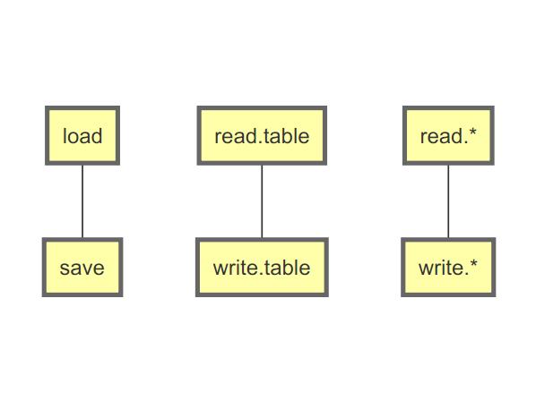

```{r preambule, echo=FALSE, message=FALSE, warning=FALSE}
require(DiagrammeR)
```

# Lire et écrire des données


Objectif du cours : lire et sauvegarder 

 * des __objets R__
 * et des __données tabulées__.
 


## Lire et sauvegarder : résumé

Commande | lire | sauvegarder
--|--|--
`data` | Oui | Non
`load` | Oui | Non
`save` | Non | Oui
`read.table` | Oui | Oui
`write.table` | Non | Oui
`read.*` | Oui | Oui
`write.*` | Non | Oui

## Correspondance

```{r diag, echo=F, eval=F, fig.ext='png', fig.keep='all'}
DiagrammeR("
   graph TB
   load --- save
   read.table --- write.table
   read.* --- write.*
")
```



## `data`

 * Exemple : `data(cars)`.
 * Avant et après : `ls()`.
 * La classe de l'objet : `class(cars)`.
 * A l'intérieur de l'objet : `str(cars)`.
 * Le début du tableau : `head(cars)`.


## Changer de répertoire de travail

Il est très important de pouvoir changer de répertoire de travail.

Cela peut se faire :

 * en ligne de commande, avec `setwd` et `getwd`,
 * ou très simplement avec l'interface graphique de R Studio !


## Données tabulées

 * une ligne de noms de colonnes,
 * des lignes séparées par une __EOL__ (_end of line_),
 * un séparateur de colonnes (tabulation, `;`, etc.),
 * le même nombre de colonnes par ligne.

## Remarque : Format *long* et *wide*

```{r, echo=FALSE, message=FALSE, warning=FALSE}
require(stats)
require(data.table)
pg <- unstack(PlantGrowth)   
```


<div class="columns-2">

```{r, echo=FALSE}
print(data.table(pg))
```

```{r, echo=FALSE}
print(data.table(stack(pg)), topn = 5)
```

</div>


## Lire des données avec `read.table`

5 paramètres importants :

 * `file` $\to$ chemin (absolu ou relatif) vers le fichier tabulé à lire,
 * `header` $\to$ booléen indiquant si la première ligne contient les noms des colonnes,
 * `sep` $\to$ chaine de caractère spécifiant comment sont séparées les colonnes, 
 * `dec` $\to$ séparateur décimal ($3,1419$ ou $3.1419$ ?),
 * `skip` $\to$ entier indiquant combien de lignes il faut ignorer en début de fichier. 


## Ecrire des données avec `write.table`

4 paramètres importants :

 * `x` $\to$ objet (`matrix` ou `data.frame`) à écrire,
 * `file` $\to$ chemin (absolu ou relatif) vers le fichier tabulé qui sera créé,
 * `sep` $\to$ chaine de caractère spécifiant comment sont séparées les colonnes, 
 * `dec` $\to$ séparateur décimal ($3,1419$ ou $3.1419$ ?).


## Sauvegarder et charger des données avec `save` et `load`

 * La fonction `save` permet de sauvegarder dans un fichier n'importe quel objet R.
 * La fonction `load` permet de charger en mémoire les objets sauvegardés dans un fichier créé avec `save`.
 
_Exemple :_

```{r, eval=F}
x <- 1:10 ; a <- "toto" ; objetaunomtreslong <- pi
save(x, a, objetaunomtreslong, file="Sauvegarde.RData")
rm(list=ls())
load("Sauvegarde.RData")
```

# Librairies et scripts

## Télécharger / installer / charger un _package_

 * _Qu'est-ce que c'est_ ? Des scripts, des données, de la documentation.
 * _Comment les installer_ ? Démonstration avec RStudio.
 * _Comment les charger en mémoire_ ? Avec les fonction `library` ou `require`.

## Faire ses propres scripts

 + Enregistrer des fonctions / commandes dans un fichier `*.R`.
 + Sauvegarder le fichier...
 + Utiliser la fonction `source`.
 + Démo sur DataJoy.
 + Démo sur R Studio.
