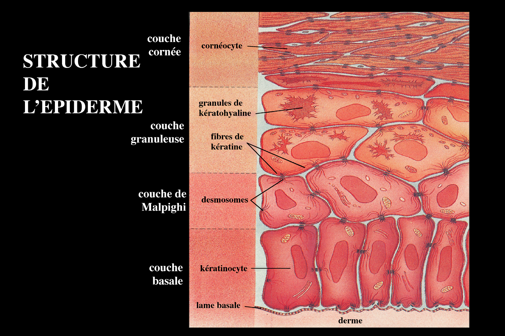
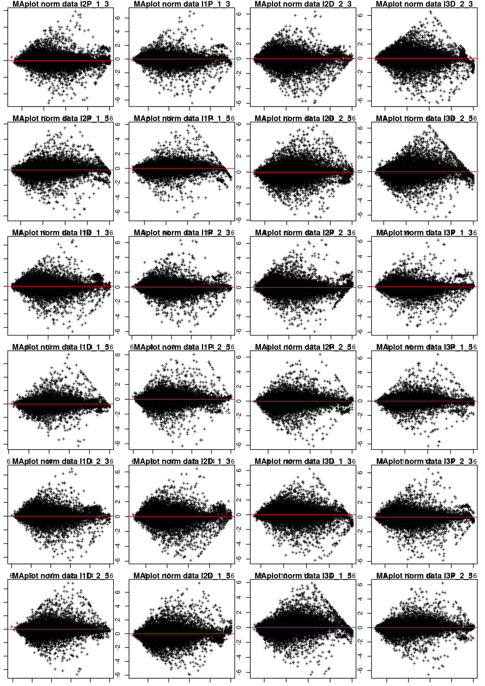
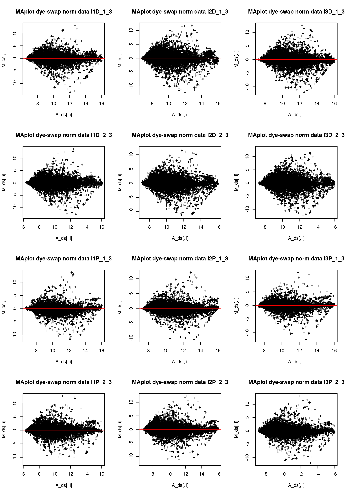

# Problématique Biologique : la différenciation des kératinocytes

Les kératinocytes subissent en permanence une évolution morphologique témoignant de leur kératinisation sous-tendant le rôle de barrière protectrice (mécanique et chimique) de l'épiderme. Cette évolution se fait de la profondeur vers la superficie et permet de distinguer sur une coupe d'épiderme quatre couches superposées de la profondeur vers la superficie : la couche germinative (ou basale), la couche à épines (ou épineuse), la couche granuleuse et la couche cornée (compacte, puis desquamante) : Figure 1.



\begin{center}
Figure 1 : Structure de l’épiderme.
\end{center}

La **couche germinative ou basale** assure par les mitoses de ses cellules le renouvellement de l'épiderme ; ses cellules, cubiques ou prismatiques, contiennent de nombreux grains de mélanine phagocytés qui permettent à l'épiderme d'assurer son rôle de protection de la lumière et qui sous-tendent le rôle de régulation de la pigmentation cutanée qu'ont les kératinocytes.

Dans la **couche épineuse**, les cellules commencent à s'aplatir, mais le noyau et les organites cytoplasmiques sont intacts, les filaments intermédiaires de kératine groupés en faisceaux denses, les desmosomes normaux.

Dans la **couche granuleuse**, la cellule est très aplatie, le noyau commence à dégénérer et surtout apparaissent au sein des trousseaux de filaments de kératine de nombreux grains de kératohyaline.

Enfin, dans la **couche cornée**, le kératinocyte (qui prend maintenant le nom de cornéocyte) est complètement aplati, le noyau et les organites cytoplasmiques ont totalement disparu et le cytoplasme est rempli de trousseaux fibrillaires formés à partir des filaments de kératine et des grains de kératohyaline. En superficie de la couche cornée, les cornéocytes, se détachent de l'épiderme (desquamation).

Le kératinocyte passe donc d’un état prolifératif dans la couche basale à un état de différenciation terminale dans la couche cornée avant sa mort cellulaire et sa desquamation. Dans la peau, ce cycle de différenciation dure une vingtaine de jours. Ce processus de différenciation peut-être reproduit *in vitro*. Notamment, en culture, les kératinocytes se différencient naturellement à partir du moment où la confluence est atteinte, cette technique a été utilisée pour générer les données que nous allons analyser.

# Objectif 
L’objectif du TP est d’analyser la modulation de l'expression des gènes au cours de la différenciation in vitro de kératinocytes humains. Des expériences d'analyse du transcriptome ont été réalisées en utilisant des puces à ADN sur lesquelles ont été déposées des oligonucléotides longs.

Répondez aux questions dans un document Rmarkdown produisant un fichier __PDF__.

Pour afficher l'aide sur la syntaxe de Rmarkdown, cliquez sur le point d'interrogation dans la barre d'outil d'édition.

# Données

Au total les lames contiennent __26495 spots__.

Les cellules ont été cultivées *in vitro* dans des conditions de prolifération (noté P dans le nom de l'échantillon) ou de
différenciation (noté D dans le nom de l'échantillon).

Pour chaque état P ou D, une extraction d'ARN a été faite pour 3 individus différents (I1, I2 et I3). Deux inversions de marquage ont ensuite été réalisées pour chaque échantillon en utilisant une référence commune (le numéro de l'inversion de fluorochrome est noté `_1` ou `_2` dans le nom de l'échantillon et le fluorochrome de l'ARN test est noté `_3` pour Cy3 et `_5` pour Cy5).

# Analyse des données

## 1. Lecture de fichiers de données

> **Question** : Chargez en mémoire les fichiers `data1_R.txt`, `data1_G.txt`, `data2_M.txt`, `data2_A.txt`, `pheno.txt` et `pheno_ds.txt`. Expliquez chacune des options utilisée.

```{r chargement_donnees, echo=FALSE, eval=FALSE}
require(convert)
require(marray)

PATHDATA <- "~/Enseignements/TP-Genomique-Marie-Anne/data"

l <- read.table(text="ID:NLINE:TERM
I1D_1_3.gpr:110:Block
I1D_1_5.gpr:110:Block
I1D_2_3.gpr:110:Block
I1D_2_5.gpr:110:Block
I1P_1_3.gpr:110:Block
I1P_1_5.gpr:110:Block
I1P_2_3.gpr:110:Block
I1P_2_5.gpr:110:Block
I2D_1_3.gpr:110:Block
I2D_1_5.gpr:110:Block
I2D_2_3.gpr:110:Block
I2D_2_5.gpr:110:Block
I2P_1_3.gpr:32:Block
I2P_1_5.gpr:32:Block
I2P_2_3.gpr:110:Block
I2P_2_5.gpr:110:Block
I3D_1_3.gpr:110:Block
I3D_1_5.gpr:110:Block
I3D_2_3.gpr:110:Block
I3D_2_5.gpr:110:Block
I3P_1_3.gpr:110:Block
I3P_1_5.gpr:110:Block
I3P_2_3.gpr:110:Block
I3P_2_5.gpr:110:Block", sep=":", header=TRUE, stringsAsFactors=F)
ids <- split(l$ID, l$NLINE)

galinfo <- read.Galfile(galfile = "AWS.gal", path=PATHDATA, skip = 133)
data1 <- read.GenePix(fnames = ids[[1]], path = PATHDATA, skip = as.numeric(names(ids)[1])-1, 
                      name.Gb=NULL, name.Rb=NULL)
data2 <- read.GenePix(fnames = ids[[2]], path = PATHDATA, skip = as.numeric(names(ids)[2])-1, 
                      name.Gb=NULL, name.Rb=NULL)

data1@maLayout <- galinfo$layout
data2@maLayout <- galinfo$layout
data1@maGnames <- galinfo$gnames
data2@maGnames <- galinfo$gnames
data <- cbind(data1, data2)

pheno <- read.csv(paste(PATHDATA, "pheno.txt", sep="/"))


```


> **Question** : Quelle est la classe des objets chargés en mémoire et quelles en sont les dimensions ? Affichez un extrait de chaque structure.


```{r, echo=FALSE, eval=FALSE}

good <- rowSums(data@maW)==0
dat <- data[good, ]

my_R <- dat@maRf
colnames(my_R) <- gsub("~/Enseignements/TP-Genomique-Marie-Anne/data/", "", colnames(my_R))
colnames(my_R) <- gsub(".gpr", "", colnames(my_R))
rownames(my_R) <- dat@maGnames@maLabels

my_G <- dat@maGf
colnames(my_G) <- gsub("~/Enseignements/TP-Genomique-Marie-Anne/data/", "", colnames(my_G))
colnames(my_G) <- gsub(".gpr", "", colnames(my_G))
rownames(my_G) <- dat@maGnames@maLabels

write.csv(my_R, file=paste(PATHDATA, "data1_R.txt", sep="/"))
write.csv(my_G, file=paste(PATHDATA, "data1_G.txt", sep="/"))
```

```{r classe_dim, echo=TRUE, message=FALSE}

require(convert)
require(marray)

PATHDATA <- "~/Enseignements/TP-Genomique-Marie-Anne/data"
my_R <- read.csv(paste(PATHDATA, "data1_R.txt", sep="/"))
my_G <- read.csv(paste(PATHDATA, "data1_G.txt", sep="/"))
probes <- as.character(my_R[, 1])
pheno <- read.csv(paste(PATHDATA, "pheno.txt", sep="/"), row.names=1)

(class(my_R))
(dim(my_R))
```


## 2. Normalisation

`data1_R` contient les intensités brutes dans le fluorochrome Cy5 (Red) pour chaque puce.
`data1_G` contient les intensités brutes dans le fluorochrome Cy3 (Green) pour chaque puce.
`pheno` contient le descriptif des échantillons hybridés sur chaque puce.

Le **MA-plot** est une figure de mérite de l'analyse de données de puces en expression. Le `M`, pour "Minus", correspond à la différence des logarithmes d'intensité entre les deux fluorochromes. Le `A`, pour "Average", correspond à la moyenne des logarithmes d'intensités. Les graphes representent `M(A)` pour chaque spot d'une puce, en nuage de points. 

> **Question** : Calculez `M` et `A` pour chaque lame de microarray. Produisez à partir des données fournies les **MA-plots** des données avant normalisation, pour chaque puce. Tracez en rouge la ligne M=0. Donnez les commandes utilisées et expliquez chacune des options utilisées. 

```{r MAplots_donnees_brutes, echo=TRUE, message=FALSE}
M <- log2(as.matrix(my_R[, -1])/as.matrix(my_G[, -1]))
A <- 0.5*log2(as.matrix(my_R[, -1])*as.matrix(my_G[, -1]))

png(paste(PATHDATA, "maplot_raw/maplot_raw.png", sep="/"), 
    units = "cm", width=21, height=29.7, res=300)
layout(matrix(1:24, nrow=6, ncol=4))
par(mar=c(1, 1, 1, 1))
for (i in 1:length(colnames(M))){
  plot(M[, i]~A[, i], main=paste("MAplot raw data ", 
                                 colnames(M)[i], sep=""), pch="+")
  abline(h = 0, col="red")
}
dev.off()

```


Indication : Utilisez la fonction `layout()` pour la mise en page des graphes. Les mettre dans une grille de sorte qu'ils tiennent tous sur la meme page. Utilisez un device __png__, puis incluez-le dans le document Rmarkdown.

> **Question** : Quelle doit être la forme du nuage de points ? Est-ce le cas pour toutes les puces ? Sinon, pourquoi les nuages de points sont-ils déformés ?

`data2_M` contient les `M` normalisés pour chaque puce.
`data2_A` contient les `A` normalisés pour chaque puce.

> **Question** : Produisez les *MA-plots* sur données normalisées pour chaque puce, en utillisant la meme mise en page. Quels sont les changements observés?

```{r norm_printtiploess, echo=FALSE, eval=FALSE}
datnorm <- maNorm(dat, norm="printTipLoess", subset=TRUE)

my_M_norm <- datnorm@maM
colnames(my_M_norm) <- colnames(M)
rownames(my_M_norm) <- rownames(M)
my_A_norm <- datnorm@maA
colnames(my_A_norm) <- colnames(A)
rownames(my_A_norm) <- rownames(A)

write.csv(my_M_norm, file=paste(PATHDATA, "data2_M.txt", sep="/"))
write.csv(my_A_norm, file=paste(PATHDATA, "data2_A.txt", sep="/"))
```

```{r MA_plot_norm_printtiploess, echo=TRUE, message=FALSE}

my_M_norm <- read.csv(paste(PATHDATA, "data2_M.txt", sep="/"))
my_M_norm <- as.matrix(my_M_norm[, -1])
my_A_norm <- read.csv(paste(PATHDATA, "data2_A.txt", sep="/"))
my_A_norm <- as.matrix(my_A_norm[, -1])

png(paste(PATHDATA, "maplot_norm/maplot_norm.png", sep="/"), 
    units = "cm", width=21, height=29.7, res=300)
layout(matrix(1:24, nrow=6, ncol=4))
par(mar=c(1, 1, 1, 1))
for (i in 1:length(colnames(my_M_norm))){
  plot(my_M_norm[, i]~my_A_norm[, i], 
       main=paste("MAplot norm data ", colnames(my_M_norm)[i], sep=""), pch="+")
  abline(h = 0, col="red")
}
dev.off()

```



Nous allons visualiser la proximité relative des observations, grâce à une __Analyse en Composantes Principales__. Il s'agit d'une méthode d'analyse multivariées par réduction de dimension. Les composantes principales sont des combinaisons linéaires des variables. Elles ont pour contraintes de maximiser la variance entre les observations et d'être orthogonales entre elles. Le nombre de composantes est égal au rang de la matrice des données. On utilise la fonction `prcomp` de `R base`.

> **Question** : Centrez les données à l'aide de la fonction `scale()`. Calculez les composantes grâce à la fonction `prcomp`. Combien y a-t-il de composantes ? Représentez graphiquement les observations en fonction des deux premières composantes, colorez les points en fonction de la colonne "dye" et changez la forme des points (paramètre `pch` de la fonction `plot`) en fonction de la colonne "prodiff" du tableau de données "pheno". Incluez le graphe directement sans passer par un fichier annexe. Que constatez-vous ?

```{r ACP_dye-swap, echo=TRUE}
M_centered <- scale(t(my_M_norm), center=T, scale=FALSE)

M_acp <- prcomp(M_centered, retx = T)

plot(M_acp$x[, "PC2"]~M_acp$x[, "PC1"], 
     main="Analyse en Composantes Principales\nInversion de fluorochromes", 
     col=-as.numeric(as.factor(pheno$dye))+4, xlab="PC1", ylab="PC2", 
     pch=as.numeric(as.factor(pheno$prodiff))+14, cex=2)
legend("top", c("Cy3","Cy5","Diff","Prolif"), col=c("green","red","black","black"), pch=c(1,1,15:16), cex=2, bty="n")

```


Le biais résiduel se corrige grâce au "dye-swap" (inversion de fluorochrome). Pour chaque comparaison, chaque condition sera marquée une fois en rouge (Cy5) et une fois en vert (Cy3). La moyenne des `M` et des `A`, sur les deux sens de marquage permet d'obtenir une mesure d'intentsité unique corrigée pour le biais d'intensité.

> **Question** : Calculez les `M` et les `A`, sur les deux sens de marquages. Produisez les *MA-plots* correspondants, avec la meme mise en page que les *MA-plots* précedents. Que constatez-vous ?

```{r norm_dye_swap, echo=TRUE}

M_cy3 <- my_M_norm[,which(pheno$dye == "Cy3")]
M_cy3 <- M_cy3[, sort(colnames(M_cy3))]
M_cy5 <- my_M_norm[,which(pheno$dye == "Cy5")]
M_cy5 <- M_cy5[, sort(colnames(M_cy5))]

M_ds <-  M_cy3 - M_cy5
colnames(M_ds) <- colnames(M_cy3)

A_cy3 <- my_A_norm[,which(pheno$dye == "Cy3")]
A_cy3 <- A_cy3[, sort(colnames(M_cy3))]
A_cy5 <- my_A_norm[,which(pheno$dye == "Cy5")]
A_cy5 <- A_cy5[, sort(colnames(A_cy5))]

A_ds <-  0.5*(A_cy3 + A_cy5)
colnames(A_ds) <- colnames(A_cy3)

png(paste(PATHDATA, "maplot_norm_ds/maplot_ds.png", sep="/"), 
    width=21, h=29.7, units="cm", res=300)
layout(matrix(1:12, nrow=4, ncol=3))
for (i in 1:length(colnames(M_ds))){
  plot(M_ds[, i]~A_ds[, i], main=paste("MAplot dye-swap norm data ", 
                                       colnames(M_ds)[i], sep=""), 
       pch="+")
  abline(h = 0, col="red")
}
dev.off()

```


Il s'agit maintenant de pouvoir comparer toutes les conditions entre elles. Pour pouvoir ultérieurement, appliquer un test statistique, il faut au préalable s'assurer que les distributions les données de chaque conditions sont comparables. Un moyen de s'en assurer est de produire un graphe en boîte à moustaches (`boxplot`), qui visualise pour chaque condition la médiane des `log(intensités des sondes)`, les premier et troisième quartiles ainsi que les queues de distributions. Les données qui nous intéressent sont les `M`, c'est-à-dire la différence d'intensité et donc d'expression entre le fluorochrome, qui marque l'échantillon *test* et celui qui marque l'échantillon *référence*.

> **Question** : Produisez les *boxplots* des données normalisées. Si les conditions sont comparables entre elles, quelle figure doit-on obtenir ? Qu'obtenez-vous ? Quelle est votre conclusion ?

```{r boxplot, echo=TRUE}

boxplot(M_ds, main="Boxplot M dye-swap norm data", las=2, col=palette(rainbow(3)))
abline(h=0)

```

Nous allons procéder à la normalisation des __quantiles__, grâce à la fonction `normalizeBetweenArrays` du package `limma`. Pour cela, sourcez le fichier `biocLite.R`, qui se trouve à l'URL suivante : [http://www.bioconductor.org/](http://www.bioconductor.org/); Installez le package `limma` en utilisant la commande suivante : `biocLite("limma")`.

> **Question** : Chargez le package `limma` dans l'environnement de travail. Affichez l'aide de la fonction `normalizeBetweenArrays`. Procédez à la normalisation. Justifiez les paramètres choisis. Produisez les *boxplots* des données après normalisation des quantiles. Que constatez-vous ?

```{r quantile_norm, echo=TRUE}
library(limma)
?normalizeBetweenArrays

my_ma_q <- normalizeBetweenArrays(M_ds, method = "quantile")

boxplot(my_ma_q, main="Boxplot M quantile norm data", 
        las=2, col=palette(rainbow(3)))
abline(h=0)

```

Les données sont à présent normalisées et prêtes à l'emploi. Le fichier `pheno_ds.txt` contient le descriptif des échantillons une fois normalisés en "dye-swap".

> **Question** : Calculez à nouveau des composantes principales de la matrice des `M` obtenus et représentez graphiquement les observations en fonctions des deux premières composantes principales. La couleur des points s'affichera en fonction de la colonne "ID" du tableau de données `pheno_ds` et la forme des points s'affichera en fonction de la colonne "prodiff". Que constatez-vous?

```{r acp_dye-swap_norm, echo=T}

M_centered <- scale(t(my_ma_q), center=T, scale=FALSE)

M_acp <- prcomp(M_centered, retx = T)

pheno_ds <- read.csv(paste(PATHDATA, "pheno_ds.txt", sep="/"))

plot(M_acp$x[, "PC2"]~M_acp$x[, "PC1"], 
     main="Analyse en Composantes Principales - Dye-swap + Quantile", 
     col=as.numeric(as.factor(pheno_ds$ID)), 
     pch=as.numeric(as.factor(pheno_ds$prodiff))+14, 
     cex=2, xlab="PC1", ylab="PC2")
legend("top", c("I1","I2","I3","Diff","Prolif"), col=c(rainbow(3),"black","black"), pch=c(1,1,1,15:16), cex=2, bty="n")

```

