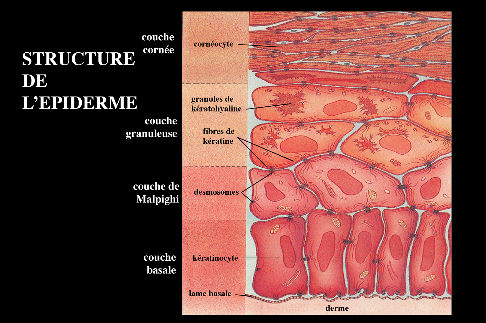

# Problématique Biologique : la différenciation des kératinocytes

Les kératinocytes subissent en permanence une évolution morphologique témoignant de leur kératinisation sous-tendant le rôle de barrière protectrice (mécanique et chimique) de l'épiderme. Cette évolution se fait de la profondeur vers la superficie et permet de distinguer sur une coupe d'épiderme quatre couches superposées de la profondeur vers la superficie : la couche germinative (ou basale), la couche à épines (ou épineuse), la couche granuleuse et la couche cornée (compacte, puis desquamante) : Figure 1.

\begin{center}
> *Figure 1 :* structure de l’épiderme.

\end{center}

La **couche germinative ou basale** assure par les mitoses de ses cellules le renouvellement de l'épiderme ; ses cellules, cubiques ou prismatiques, contiennent de nombreux grains de mélanine phagocytés qui permettent à l'épiderme d'assurer son rôle de protection de la lumière et qui sous-tendent le rôle de régulation de la pigmentation cutanée qu'ont les kératinocytes.

Dans la **couche épineuse**, les cellules commencent à s'aplatir, mais le noyau et les organites cytoplasmiques sont intacts, les filaments intermédiaires de kératine groupés en faisceaux denses, les desmosomes normaux.

Dans la **couche granuleuse**, la cellule est très aplatie, le noyau commence à dégénérer et surtout apparaissent au sein des trousseaux de filaments de kératine de nombreux grains de kératohyaline.

Enfin, dans la **couche cornée**, le kératinocyte (qui prend maintenant le nom de cornéocyte) est complètement aplati, le noyau et les organites cytoplasmiques ont totalement disparu et le cytoplasme est rempli de trousseaux fibrillaires formés à partir des filaments de kératine et des grains de kératohyaline. En superficie de la couche cornée, les cornéocytes, se détachent de l'épiderme (desquamation).

Le kératinocyte passe donc d’un état prolifératif dans la couche basale à un état de différenciation terminale dans la couche cornée avant sa mort cellulaire et sa desquamation. Dans la peau, ce cycle de différenciation dure une vingtaine de jours. Ce processus de différenciation peut-être reproduit in vitro. Notamment, en culture, les kératinocytes se différencient naturellement à partir du moment où la confluence est atteinte, cette technique a été utilisée pour générer les données que nous allons analyser.

# Objectif 
L’objectif du TP est d’analyser la modulation de l'expression des gènes au cours de la différenciation in vitro de kératinocytes humains. Des expériences d'analyse du transcriptome ont été réalisées en utilisant des puces à ADN sur lesquelles ont été déposées des oligonucléotides longs.

# Données

Au total les lames contiennent 26495 spots.

Les cellules ont été cultivées in vitro dans des conditions de prolifération (noté P dans le nom de l'échantillon) ou de
différenciation (noté D dans le nom de l'échantillon).

Pour chaque état P ou D, une extraction d'ARN a été faites pour 3 individus différents (I1, I2 ou I3). Deux inversions de marquage ont ensuite été réalisées pour chaque échantillon en utilisant une référence commune (le numéro de l'inversion de fluorochrome est noté `_1` ou `_2` dans le nom de l'échantillon et le fluorochrome de l'ARN test est noté `_3` pour Cy3 et `_5` pour Cy5).

# Analyse des données

## 1. Lecture d'un fichier de données

> **Question** : Quelle commande peut-on utiliser pour charger en mémoire le fichier "data_???.txt" ? Expliquez chacune des options utilisée.

> **Question** : Quel est la classe de l'objet chargé en mémoire et quelles en sont les dimensions ?

## 2. Normalisation

> **Question** : Reproduisez à partir des données fournies les **MA Plots** des données avant normalisation et après normalisation. Donnez les commandes utilisées et expliquez chacune des options utilisées. Joignez les graphes.

## 3. Analyse différentielle

> **Question** : Quels sont les 10 premiers transcrits identifiés comme différentiellement exprimés ? Donnez l'identifiant du transcrit, la valeur de la statistique de Student, la _p-value_ et la _p-value_ ajustée par la méthode de Benjamini-Hochberg.

> **Question** : Combien de transcrits sont différentiellement exprimés ?

> **Question** : Produisez un **Volcano Plot**. Expliquez la commande utilisée et joignez la figure.

## 4. Classification hierarchique

> **Question** : Produisez une **Heat Map** des données après sélection des gènes différentiellement exprimés. Sur ce graphe doit également un arbre de classification. Expliquez la commande utilisée et joignez la figure.
