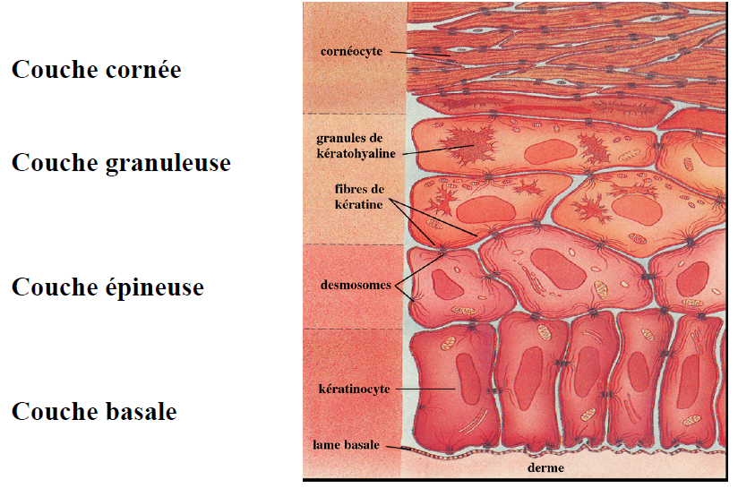

# Rappel de la problématique biologique : la différenciation des kératinocytes

Pour rappel, la Figure 1 représente la structure en différentes couches de l'épiderme.

\begin{center}
Figure 1 : Structure de l’épiderme.
\end{center}

Le kératinocyte passe donc d’un état prolifératif dans la couche basale à un état de différenciation terminale dans la couche cornée avant sa mort cellulaire et sa desquamation. Dans la peau, ce cycle de différenciation dure une vingtaine de jours. Ce processus de différenciation peut-être reproduit *in vitro*. Notamment, en culture, les kératinocytes se différencient naturellement à partir du moment où la confluence est atteinte, cette technique a été utilisée pour générer les données que nous allons analyser.

# Objectif de la deuxième partie du TP

L’objectif de cette deuxième partie est de mener une analyse différentielle des puces à ADN normalisées. Cette analyse différentielle permettra de mettre en évidence quels gènes sont différentiellement exprimés entre des cellules d'épiderme humaines en phase de prolifération et des cellules en phase de différentiation.

# Rappels sur les fichiers *R Markdown*

Pour écrire votre rapport, nous vous conseillons fortement d'écrire un nouveau fichier *R Markdown* (`.rmd`). Vous fusionnerez ensuite les deux fichiers dans votre rapport final.

# Données

Pour ce TP, afin de s'assurer que tout le monde fasse l'analyse à partir des mêmes données, nous vous proposons de charger en mémoire le fichier `donnees_analyse_diff_2015-29-10.RData`. Ce fichier contient: 

 * la matrice `X` des données d'expression (en "`log`"),
 * un vecteur `y` décrivant la variable d'intérêt (`diff` versus `prolif`),
 * un fichier d'annotation `annotationSondesHUOLI1` permettant de faire la correspondance entre la mesure d'expression (une ligne de `X`) et le transcrit auquel elle correspond (`SYMBOL`).

# Analyse des données

## 1. Lecture de fichiers de données

Commencez par charger en mémoire le fichier de données avec la fonction `load`. Assurez-vous, à l'aide de l'onglet *Environment* de Rstudio, que tous les objets ont bien été chargés.

> **Question 1** : Quelles sont les dimensions de chacun des objets ?

## 2. Calcul du *log Fold-Change*

La définition du *Fold-Change* (FC) est la suivante : il s'agit du ratio de la moyenne des intensités d'expression entre deux groupes d'intérêt. Ce FC se calcule sans la transformation logarithmique. Si on note, pour une sonde $j$ donnée, $\bar x_1$ la moyenne du groupe 1 et $\bar x_2$ la moyenne du groupe 2, alors le FC de la sonde $j$ vaut 
\[FC_j = \frac{\bar x_1}{\bar x_2}.\]

On préfère, pour des raisons pratiques, raisonner sur le *log Fold-Change* (logFC), qui est simplement obtenu en prenant le logarithme naturel du FC. Ainsi : 

 * si $log(FC_j) > \kappa$, on dit que le transcrit correspondant à la sonde $j$ est sur-exprimé dans le groupe 1 par rapport au groupe 2,
 * si $log(FC_j) < -\kappa$, on dit que le transcrit correspondant à la sonde $j$ est sous-exprimé dans le groupe 1 par rapport au groupe 2,
 
avec $\kappa$ une certaine valeur seuil[^1], qui dépend beaucoup de l'expérience. Habituellement, on choisit $\kappa=1$ car cela signifie que la valeur moyenne d'expression est deux fois plus (resp. moins) grande dans un groupe que dans l'autre.

[^1]: Attention, cette notation de $\kappa$ pour un seuil de logFC n'est pas universelle, elle est même spécifique de cet énoncé TP. Si vous choisissez d'appeler le seuil ainsi dans votre rapport, n'oubliez pas de le préciser !

> **Question 2** : Calculez le logFC du groupe `prolif` par rapport au groupe `diff`. Représentez de manière synthétique à l'aide d'un diagramme en bâtons le nombre de gènes sur- et sous- exprimés dans le groupe `prolif` par rapport au groupe `diff` (prenez un seuil de 1).

## 3. Calcul des *p-values*

Lorsque l'on fait un test d'hypothèses, une manière synthétique de représenter le résultat du test est la *p-value* (moins couramment appelée *valeur p*). Par définition, la *p-value* obtenue représente la probabilité sous hypothèse nulle d'obtenir une statistique encore plus atypique que celle obtenue à la suite de notre expérience.

A partir du calcul de la *p-value*, la conclusion d'un test d'hypothèses se déroule comme suit :

 * si la _p-value_ est en dessous du seuil de rejet que j'ai choisi (habituellement : 0.05), je rejette l'hypothèse nulle,
 * sinon, je ne peux pas rejeter l’hypothèse nulle.

> **Question 3** : Calculez pour toutes les sondes (*ie* les lignes de `X`) les *p-values* d'un test de Student comparant les deux moyennes des groupes `prolif` et `diff` en utilisant la fonction `t.test` et ses paramètres par défaut. Combien de ces *p-values* sont-elles en dessous du seuil classique de 0.05 ?

## 4. Correction pour les tests multiples

Les tests d'hypothèses n'ont pas été créés dans l'optique d'être utilisés plus de 20 000 fois de façon successive : si on suit la procédure habituelle, on risque de rejeter l'hypothèse nulle à tort beaucoup trop souvent. La conséquence immédiate et néfaste de ces *tests multiples* est d'augmenter artificiellement le nombre de gènes différentiellement exprimés.

Une correction pour les tests multiples est donc nécessaire. La procédure la plus simple est de diminuer le seuil de rejet (c'est la procédure dite de Bonferroni). Nous allons utiliser dans ce TP la procédure qui est utilisée classiquement en transcriptomique : la procédure de Benjamini-Hochberg.

> **Question 4** : Utilisez sur le vecteur des *p-values* calculées précédemment la procédure `p.adjust` en attribuant à l'argument `method` la valeur `"BH"`. Après correction, combien de *p-values* ajustées se trouvent en dessous du seuil de 0.05 ?

## 5. Conclusion et représentations graphiques

Une liste de gènes différentiellement exprimés est caractérisée par deux seuils : 

 * un seuil sur le _log Fold-Change_,
 * un seuil sur la _p-value_ corrigée
 
> **Question 5.1** : Combien de sondes passent un seuil en logFC de 1 et un seuil sur la *p-value* ajustée de 0.05 ?

Une première représentation graphique permettant de synthétiser ce résultat est une représentation dite *en volcan* : il s'agit de représenter, pour toutes les sondes, un graphe bivarié, avec en abscisse le logFC et en ordonnée $-log_{10}(\text{p-value ajustée})$.

> **Question 5.2** : Faites une représentation en volcan de votre analyse différentielle (avec la fonction `plot`). Représentez sur ce graphe les seuils sur le logFC et la *p-value* ajustée (avec la fonction `abline`). Représentez de deux couleurs différentes les sondes sur- et sous-exprimées (avec l'argument `col` de la fonction `plot`). Ajoutez sur ce graphe le nombre de sondes sur- et sous-exprimées dans une légende.

> **Question 5.3** : Enfin, représentez à l'aide de la fonction `pheatmap` une représentation des mesures d'expression (contenue dans la matrice `X`) uniquement pour les transcrits différentiellement exprimés, et dont la légende contient les informations contenues dans le fichier `pheno2.tsv`.

