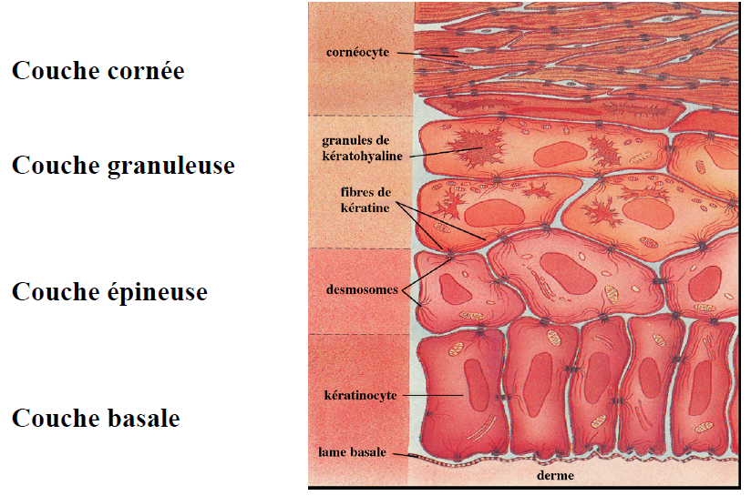
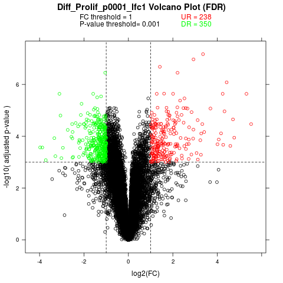
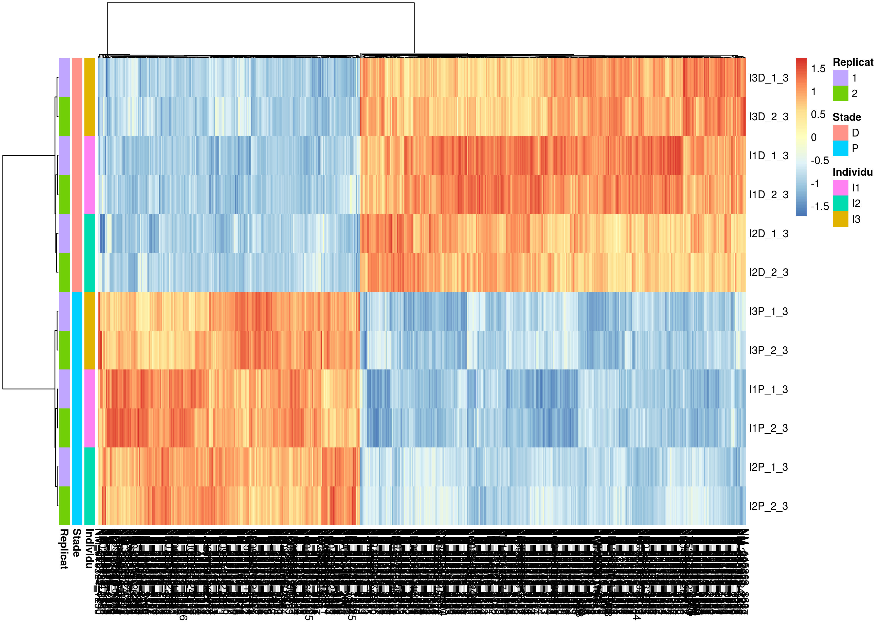

# Rappel de la problématique biologique : la différenciation des kératinocytes

Pour rappel, la Figure 1 représente la structure en différentes couches de l'épiderme.



\begin{center}
Figure 1 : Structure de l’épiderme.
\end{center}

Le kératinocyte passe donc d’un état prolifératif dans la couche basale à un état de différenciation terminale dans la couche cornée avant sa mort cellulaire et sa desquamation. Dans la peau, ce cycle de différenciation dure une vingtaine de jours. Ce processus de différenciation peut-être reproduit *in vitro*. Notamment, en culture, les kératinocytes se différencient naturellement à partir du moment où la confluence est atteinte, cette technique a été utilisée pour générer les données que nous allons analyser.

# Objectif de la troisième partie du TP

L’objectif de cette troisième partie est d'interpréter les résultats de l'analyse différentielle des puces à ADN. Cette analyse différentielle a permis de mettre en évidence les gènes différentiellement exprimés entre des cellules d'épiderme humain en phase de prolifération et des cellules en phase de différenciation.

# Rappels sur les fichiers *R Markdown*

Pour écrire votre rapport, nous vous conseillons fortement d'écrire un nouveau fichier *R Markdown* (`.rmd`). Vous fusionnerez ensuite les trois fichiers dans votre rapport final.

# Sélection des gènes différentiellement exprimés à analyser

En jouant sur les seuils de *fold change* et de p-valeur, vous allez déterminer la liste des gènes différentiellement exprimés entre l'état de prolifération et celui de différenciation des kératinocytes humains, pour laquelle vous allez faire une annotation fonctionnelle afin d'interpréter biologiquement les résultats.

> **Question 1** : Générez à nouveau un *volcano plot* en appliquant les seuils suivants : logFC = 1 et p-valeur ajustée = 0.001. Interprétez cette figure. 

Récupérez la matrice des données normalisée correspondante aux gènes respectant ces seuils. 

> **Question 2** : Combien de gènes sont sous-exprimés ? Combien sont sur-exprimés ? Stockez-les dans deux matrices différentes.

```{r seuils}
load("~/Enseignements/TP-Genomique-Marie-Anne/resultats_analyse_diff_ttest.Rdata")
#topT, X, Xdiff, y, annotationSondesHUOLI1, pheno_ds
VolcanoPlot <- function(topT, FCthres, Pvalthres, name) {
  
  library(lattice)
	#topTable = ID     logFC          t      P.Value    adj.P.Val        B
        # Calcul de l'abscisse et de l'ordonnee
        if (is.element("adj.P.Val", colnames(topT))) {
	    # print("pvalues ajustees")
            B <- -log10(topT$adj.P.Val);
            lab <- "-log10( adjusted p-value )";
            titre <- paste(name," Volcano Plot (FDR)",collapse="",sep="")
        } else {
            B <- -log10(topT$P.Value);
            lab <- "-log10( p-value )";
            titre <- paste(name," Volcano Plot");
        }
       
        # Trois groupes de gènes : UR, DR et le reste.
        gauche <- intersect( which(B>-log10(Pvalthres)) , which(topT$logFC < -FCthres))
        droite <- intersect( which(B>-log10(Pvalthres)) , which(topT$logFC > FCthres))

        textseuil1 <- paste("FC threshold = ",FCthres,collapse="",sep="")
        textseuil2 <- paste("P-value threshold= ",Pvalthres,collapse="",sep="")
        UR <- paste("UR = ",length(droite),collapse="",sep="")
        DR <- paste("DR = ",length(gauche),collapse="",sep="")

        g <- rep(1,length(topT$logFC)); g[gauche] <- 2; g[droite] <- 3
        donnees <- data.frame(FC=topT$logFC,B=B,g=g)
        # print(donnees[sample(1:length(topT$logFC),10),])

        graphes <- xyplot(B ~ topT$logFC,groups=g, 
                          panel = function(x,y,subscripts,groups) {panel.abline(h=-log10(Pvalthres),
                                                                                 v=c(-FCthres,FCthres),lty=2); 
                                                                    panel.superpose(x,y,groups=g,subscripts=subscripts,
                                                                                    col=c("black","green","red"))},
                          xlab="log2(FC)", ylab=lab, 
                          main = titre, key=list(space="top",col=c("black","black","red","green"), 
                                                           text=list(lab=c(textseuil1,textseuil2,UR,DR)),columns = 2))
        return(graphes)
}

vp <- VolcanoPlot(topT = topT, FCthres = 1, Pvalthres = 0.001, name = "Diff_Prolif_p0001_lfc1")
png ("volcanoPlot_Diff_Prolif_p0001_lfc1.png")
plot(vp)
dev.off()
```

\begin{center}
Figure 2 : Volcano plot des gènes différentiellement exprimés. Seuil Pval = 0.001, seuil logFC = 1.
\end{center}

```{r effectifs}
# nb de gènes sur-exprimés
(dim(X[topT$ProbeID[which(topT$logFC > 1 & topT$adj.P.Val<0.001)],])[1])

# nb de gènes sous-exprimés
(dim(X[topT$ProbeID[which(topT$logFC < (-1) & topT$adj.P.Val<0.001)],])[1])

X_up <- X[as.character(topT$ProbeID[which(topT$logFC>1 & topT$adj.P.Val<0.001)]),]
X_dw <- X[as.character(topT$ProbeID[which(topT$logFC <(-1) & topT$adj.P.Val<0.001)]),]

```

# Classification des données

En utilisant la fonction `pheatmap()` du package `pheatmap`, générez un clustering hiérarchique assorti d'une carte de chaleur pour la matrice regroupant les gènes sous- et les sur-exprimés au cours de la différenciation, en utilisant la corrélation de Pearson comme distance et `average` comme critère d'agrégation. 

> **Question 3** : Analysez le regroupement des observations.

```{r clustering}
X_both <- rbind(X_up, X_dw)
# nb de gènes différentiellement exprimés
(dim(X_both))

require(pheatmap)

pheno_ds <- read.csv("~/Enseignements/TP-Genomique-Marie-Anne/data/pheno_ds.txt")
colnames(X_both) <- pheno_ds[order(pheno_ds$prodiff), "fichier"]
nstr <- colnames(X_both)
colfac <- data.frame(Individu=substr(nstr,1,2), 
                     Stade=substr(nstr,3,3), 
                     Replicat=substr(nstr,5,5),
                     row.names = nstr)
png("heatmap_diff_prolif_p0001_lfc1_pearson_average.png", w=29.7, h=21, units = "cm", res=300)
pheatmap(t(X_both), annotation_row = colfac, clustering_distance_rows = "correlation", 
         clustering_distance_cols = "correlation", clustering_method = "average", 
         scale = "column", annotation_col = NULL)
dev.off()

```

\begin{center}
Figure 3 : Clustering hiérarchique et carte de chaleur des gènes différentiellement exprimés. Distance corrélation de Pearson, méthode "average".
\end{center}


# Annotation des sondes
Afin de pouvoir procéder à l'annotation fonctionnelle, vous devez préalablement modifier les identifiants de votre liste de gènes. Les identifiants sont de la forme `NM_123456_789`. La première partie (`NM_123456`) correspond à l'identifiant GenBank du gène correspondant tandis que la seconde partie (`_789`) correspond à la position de la sonde sur le transcrit. Nous allons utiliser ces identifiants pour annoter les sondes en termes de fonction, grace à Gene Ontology.

> **Question 4** : En utilisant la fonction `gsub()`, récupérez les identifiants GenBank pour chaque sonde. Annotez les sondes différentiellement exprimées avec ces identifiants. Suggestion : utilisez une expression régulière avec l'option `perl=TRUE`.

```{r GenBank}
gb_up <- gsub(x = rownames(X_up), pattern = "(_[0-9]+$)", perl = TRUE, replacement = "")
gb_dw <- gsub(x = rownames(X_dw), pattern = "(_[0-9]+$)", perl = TRUE, replacement = "")

X_up <- cbind(GenBank = gb_up, X_up)
X_dw <- cbind(GenBank = gb_dw, X_dw)

```

# Recherche bibliographique

> **Question 5** : Quels sont les 2 gènes les plus induits et les deux gènes les plus réprimés au cours de la différenciation des kératinocytes ? Sont-ils déjà connus comme impliqués dans la différenciation de l’épiderme ? Vous pouvez vous aidez de la base de données de référence de la littérature biomédicale Pubmed (http://www.ncbi.nlm.nih.gov/pubmed).

* CXCL1 Gene(Protein Coding)
Chemokine (C-X-C Motif) Ligand 1 (Melanoma Growth Stimulating Activity, Alpha)

* TFPI2 : tissue Factor Pathway Inhibitor 2
rien de connu dans diff & prolif & peau

* TMEM45A : implication dans kératinisation épidermique
"High TMEM45A expression is correlated to epidermal keratinization.
Hayez A, Malaisse J, Roegiers E, Reynier M, Renard C, Haftek M, Geenen V, Serre G, Simon M, de Rouvroit CL, Michiels C, Poumay Y." Exp Dermatol. 2014 May;23(5):339-44. doi: 10.1111/exd.12403.

* KRT23 : implication dans prolif/diff autres types cellulaires

        + "Keratin 23 (K23), a novel acidic keratin, is highly induced by histone deacetylase inhibitors during differentiation of pancreatic cancer cells."
        + "Keratin23 (KRT23) knockdown decreases proliferation and affects the DNA damage response of colon cancer cells."

# Analyse de sur-représentation de catégories GO

> **Question 6** : Réaliser une analyse de sur-représentation de catégories GO indépendamment pour les gènes significativement différentiellement surexprimés et sous-exprimés dans les cellules en différenciation vs. prolifération en utilisant l’outil ToppFun (https://toppgene.cchmc.org/enrichment.jsp). Choississez les identifiants Refseq (*Entry type*) et un seuil de p-valeur de 0,01.

> **Question 7** : Quels sont les 3 processus biologiques les plus enrichis en termes de significativité parmi les gènes surexprimés? Et les gènes sous-exprimés? 

> **Question 8** : Quelles sont les trois voies de signalisation de la base de données **KEGG** significativement enrichies, si on considère les gènes réprimés pendant la différenciation ?

# Visualisation de Pathways

Nous vous proposons de visualiser en détail la modulation des gènes d'une de ces voies de signalisation.

Installez le package Bioconductor `pathview` : 

1. Sourcez le script `biocLite.R`, qui se trouve à l'URL http://www.bioconductor.org/biocLite.R.
2. Utilisez le script pour installez le package `pathview` : `> biocLite("pathview")`. Le script installe automatiquement les dépendances du package.
3. Visualisez la "vignette" : `> browseVignettes(package = "pathview")`

> **Question 8** : Quelles sont les sondes différentiellement exprimées au seuil de p-valeurs ajustées de 1% ? Quels sont les logFC correspondants ? Construisez une matrice d'une colonne contenant ces logFC. Les noms de rang de cette matrice seront les symbols correspondant aux sondes.

```{r seuil 1%}
sondes_p001 <- as.character(topT$ProbeID[which(topT$adj.P.Val < 0.01)])
symb <- annotationSondesHUOLI1[sondes_p001, "SYMBOL"]
top_lfc <- matrix(topT[sondes_p001, "logFC"], nrow=length(sondes_p001))
rownames(top_lfc) <- symb

```


> **Question 9** : A l'aide de la fonction `pathview()` du package que vous venez d'installer, visualisez le *pathway* du cycle cellulaire chez l'Homme de la base de connaissance **KEGG**, en affichant le logFC pour les gènes différentiellement exprimés au seuil de 1%, dans votre jeu de données.

```{r visu cell cycle pathway, eval=FALSE}
library(pathview)
pv.out <- pathview(gene.data = top_lfc, pathway.id = "hsa04110", gene.idtype = "SYMBOL")

```


> **Question 10** : Quel gène semble jouer en role central dans le controle de cette voie de signalisation ? Est-il différentiellement exprimé dans votre analyse ? Quelle hypothèse pouvez-vous faire pour expliquer cette observation ?
